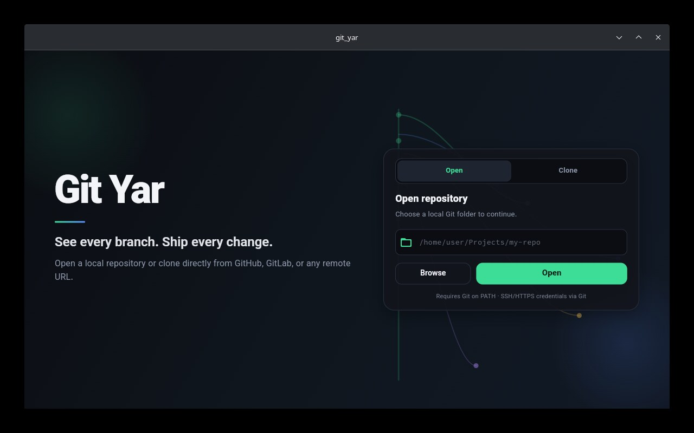
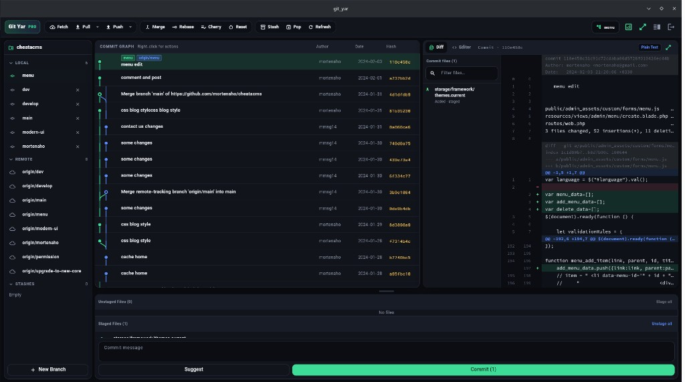

# Git Yar

Professional desktop Git client.

**See every branch. Ship every change.**

## Screenshots

### Welcome


### Pro workspace


## Features

- **Pro workspace** (GitKraken-style)
  - Colored commit graph + right-click actions
  - Merge / Rebase / Cherry-pick / Reset / Tag
  - Pull (merge|rebase), Push / Force-with-lease
  - Conflict Resolver
  - File list per commit + Diff / Code editor (fullscreen popup)
  - **Professional Reports** (activity, contributors, hot files, Markdown export)
  - Sidebar: Local / Remote / Stash
  - Staging + Commit
- Open local repositories

## Website

GitHub Pages: **https://mortenaho.github.io/git-yar/**

**Important:** do **not** use Source = GitHub Actions (that failed workflow is unrelated). Ignore the red Actions error.

Enable the site once:

1. Open https://github.com/mortenaho/git-yar/settings/pages  
2. Under **Build and deployment** set **Source** to **Deploy from a branch**  
3. Branch: **`gh-pages`** · Folder: **`/ (root)`**  
4. Click **Save**  
5. Wait 1–2 minutes, then open https://mortenaho.github.io/git-yar/

(Alternative: branch `main` + folder `/docs` also works.)

## Downloads

**v1.0.0**

- **Linux:** https://github.com/mortenaho/git-yar/releases/download/v1.0.0/git-yar-1.0.0-linux-x64.tar.gz
- **Windows:** https://github.com/mortenaho/git-yar/releases/download/v1.0.0/git-yar-1.0.0-windows-x64.zip
- All assets: https://github.com/mortenaho/git-yar/releases/tag/v1.0.0

CI also builds on every push to `main`: [Desktop builds](https://github.com/mortenaho/git-yar/actions/workflows/desktop-builds.yml)

### Linux (local)

```bash
./scripts/build_linux.sh
# → dist/git-yar-1.0.0-linux-x64.tar.gz
```

Unpack and run `git_yar` from the bundle folder (needs GTK / system Git).

### Windows

Built on GitHub Actions (`windows-latest`). Download the `git-yar-*-windows-x64.zip` artifact, unpack, run `git_yar.exe`. Git must be on PATH.

## Run (dev)

```bash
export PATH="$HOME/flutter/bin:$PATH"
flutter pub get
flutter run -d linux
```

If `pub.dev` is blocked:

```bash
export PUB_HOSTED_URL=https://pub.flutter-io.cn
flutter pub get --offline
```

## Requirements

- Flutter 3.x
- Git on PATH
- On Linux: `kdialog` or `zenity` for folder picker
